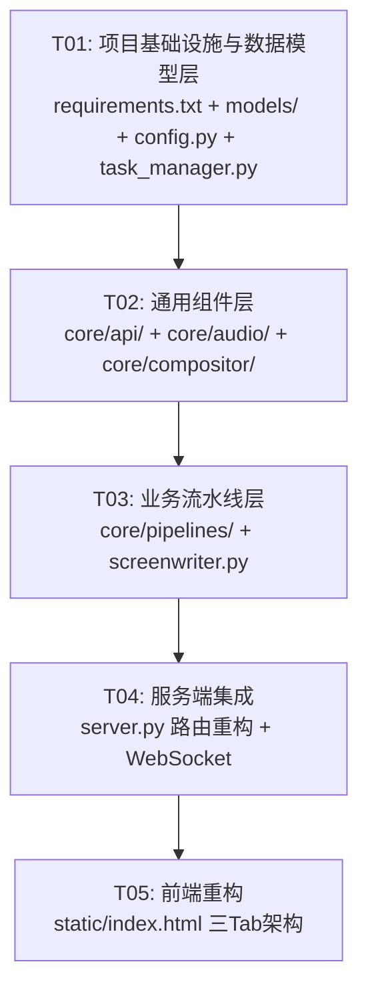

# Agnes Video Generator v2.0 — 系统设计文档

> **当前阶段**：🟢 v2.0 已完成 — 维护模式
> **配套文档**：`AGENTS.md`（规范）、`docs/regression_test_plan.md`（回归测试）

## Part A: 系统设计

---

### 1. 实现方案与框架选型

#### 核心技术挑战

| 挑战 | 分析 | 方案 |
|------|------|------|
| **三种异构任务类型** | 简单视频、创意长视频、稿件长视频流程完全不同，但共享底层 API 调用和视频处理能力 | 分层架构：通用层（api/compositor/audio）+ 业务流水层（pipelines） |
| **音频+字幕叠加** | 需要在视频生成后合成 TTS 音频 + 字幕，再与视频拼接 | edge_tts（免费）生成音频 + SRT 字幕，moviepy SubtitlesClip 叠加 |
| **断点续传兼容** | 现有 TaskManager 强绑定 TaskState 结构，需泛化支持三种任务类型 | 引入 `task_type` 字段 + 联合类型，TaskManager 保持向后兼容 |
| **单个 HTML 文件膨胀** | 三种任务类型配置面板差异大，单文件会超 3000 行 | Tab 切换架构，shared JS 提取公共逻辑，各 Tab 独立渲染函数 |
| **视频拼接策略变化** | 类型 2/3 不再是简单 concat，每段需先合成音频字幕再拼接 | compositor 层提供 `concat_with_audio()` 统一方法 |

#### 框架选型

| 组件 | 选型 | 理由 |
|------|------|------|
| **后端框架** | FastAPI（保持） | 现有框架，WebSocket 支持成熟 |
| **数据模型** | Pydantic v2（保持） | 现有依赖，类型安全 |
| **视频处理** | moviepy + ffmpeg（保持） | moviepy 提供 SubtitlesClip 原生支持字幕叠加 |
| **TTS** | edge_tts（新增） | 免费，无需 API Key，支持多语言+多角色，返回 SubMaker 含 cues（字幕时间戳） |
| **字幕格式** | SRT（标准） | edge_tts SubMaker → SRT 转换简单，moviepy SubtitlesClip 原生读取 SRT |
| **异步** | asyncio（保持） | 现有架构，视频轮询天然异步 |
| **前端** | 原生 HTML/CSS/JS + Tailwind CDN（保持） | 保持轻量，无需构建工具链 |
| **LLM 调用** | requests（同步，保持现有模式） | Screenwriter 在 asyncio.to_thread 中运行 |

#### 不引入的依赖

| 候选 | 理由 |
|------|------|
| Celery / Redis | 单机部署场景，asyncio.create_task 满足需求 |
| React / Vue | 保持零构建步骤，Tailwind CDN 足够 |
| 付费 TTS API | PRD 明确仅迁移 edge_tts 免费方案 |

---

### 2. 完整文件列表

```
agnes-video-generator/
│
├── server.py                         # [修改] FastAPI 主服务：新增路由、统一三种任务创建/恢复
├── start.sh                          # [保持]
├── requirements.txt                  # [修改] 新增 edge_tts、srt
│
├── models/
│   ├── __init__.py                   # [修改] 导出新模型
│   └── task.py                       # [重写] 泛化 TaskState，新增 TaskType/SimpleTask/ManuscriptTask/AudioConfig/SubtitleStyle
│
├── core/
│   ├── __init__.py                   # [修改]
│   ├── config.py                     # [修改] 新增音频/字幕默认配置
│   │
│   ├── api/                          # [新增目录] API 调用层（通用）
│   │   ├── __init__.py
│   │   ├── agnes_image.py            # [移动+重构] 从 core/image_generator.py
│   │   ├── agnes_video.py            # [移动+重构] 从 core/video_generator.py
│   │   └── agnes_chat.py             # [提取] Screenwriter 中的 _chat/_chat_json/_chat_multimodal 通用化
│   │
│   ├── compositor/                   # [新增目录] 视频拼接层（通用）
│   │   ├── __init__.py
│   │   ├── concatenator.py           # 视频拼接 + 音视频合成拼接
│   │   └── processor.py              # 视频处理（缩放、转码、帧提取、静音音频生成）
│   │
│   ├── audio/                        # [新增目录] 音频字幕层（通用）
│   │   ├── __init__.py
│   │   ├── tts.py                    # TTS 统一接口：EdgeTTSEngine + SilentTTSEngine
│   │   └── subtitle.py              # SRT 生成（cues→SRT）+ moviepy SubtitlesClip 叠加
│   │
│   ├── pipelines/                    # [新增目录] 业务流水线（各功能特有）
│   │   ├── __init__.py
│   │   ├── simple_video.py           # 类型 1：简单视频生成流水线
│   │   ├── creative_video.py         # [重构] 类型 2：创意长视频流水线（现有 pipeline.py + 音频字幕）
│   │   └── manuscript_video.py       # 类型 3：稿件长视频生成流水线
│   │
│   ├── screenwriter.py               # [保持+小改] 编剧 Agent（仅类型 2 使用）
│   └── task_manager.py               # [修改] 泛化支持多任务类型，保持向后兼容
│
├── utils/
│   ├── __init__.py                   # [保持]
│   ├── video.py                      # [保持]
│   └── image.py                      # [保持]
│
├── static/
│   └── index.html                    # [重写] 三 Tab 架构：简单视频 / 创意长视频 / 稿件长视频
│
└── docs/
    ├── system_design.md              # 本文档
    ├── sequence-diagram.mermaid      # 时序图
    └── class-diagram.mermaid         # 类图
```

**文件变更统计**：
- 新增：11 个文件（api/×3 + compositor/×2 + audio/×2 + pipelines/×3 + __init__.py×3，减去合并的 3 个 init = **11 个净新增**）
- 重写/重构：5 个文件（models/task.py, core/config.py, core/task_manager.py, server.py, static/index.html）
- 移动+重构：3 个文件（image_generator.py → api/, video_generator.py → api/, pipeline.py → pipelines/creative_video.py）
- 保持不变：6 个文件（utils/×3, screenwriter.py, start.sh, core/__init__.py）

---

### 3. 数据结构和接口

详见 `class-diagram.mermaid`，核心模型摘要：

**枚举与配置**：

```
TaskType: SIMPLE | CREATIVE | MANUSCRIPT
StepStatus: PENDING | RUNNING | COMPLETED | FAILED
VideoMode: t2v | i2v | ti2vid | keyframes
```

**核心模型层级**：

```
BaseTaskState          — 所有任务共享字段（task_id, task_type, status, video_width, video_height...）
├── SimpleVideoTask    — 简单视频特有字段（prompt, mode, duration, seed, reference_image, end_frame_image, negative_prompt）
├── CreativeVideoTask  — 创意长视频（现有字段 + audio_config, script_narration[]）
└── ManuscriptVideoTask— 稿件长视频（manuscript_text, paragraphs[], audio_config）

AudioConfig            — 音频配置（voice, rate, enabled）
SubtitleStyle          — 字幕样式（font, color, position, fontsize, stroke_color, stroke_width, bg_color）
ManuscriptParagraph    — 稿件段落（index, text, scene_prompt, video_file, narration_audio, subtitle_srt）
SceneTask              — 场景任务（保持现有结构）
```

**Service 类**：

```
AgnesImageAPI          — 图片生成 API 封装（t2i/i2i）
AgnesVideoAPI          — 视频生成 API 封装（t2v/i2v/ti2vid/keyframes）
AgnesChatAPI           — LLM Chat API 封装（text + multimodal）
TTSEngine (抽象)       — TTS 统一接口
├── EdgeTTSEngine      — edge_tts 实现
└── SilentTTSEngine    — 静音 + 字幕模式
SubtitleGenerator      — 字幕生成（cues→SRT, SRT 叠加到视频）
VideoConcatenator      — 视频拼接（纯拼接 / 带音频拼接）
VideoProcessor         — 缩放、转码、帧提取、静音生成
TaskManager            — 任务状态持久化（泛化）
Screenwriter           — 编剧 Agent（仅类型 2）
SimpleVideoPipeline    — 简单视频流水线
CreativeVideoPipeline  — 创意长视频流水线
ManuscriptVideoPipeline— 稿件长视频流水线
```

---

### 4. 程序调用流程

详见 `sequence-diagram.mermaid`，三组时序图：

1. **简单视频生成**：POST /api/tasks/simple → SimpleVideoPipeline.run() → AgnesVideoAPI.submit → poll → save
2. **创意长视频生成（增强）**：POST /api/tasks/creative → CreativeVideoPipeline.run() → 现有 story→script→video 流程 + 每场景生成音频+字幕+叠加 → 最终拼接
3. **稿件长视频生成**：POST /api/tasks/manuscript → ManuscriptVideoPipeline.run() → 文本拆段 → 每段生成 scene_prompt → 生成视频 → TTS+字幕叠加 → 拼接

---

### 5. 决策确认（已由用户确认）

| # | 问题 | 最终决策 |
|---|------|---------|
| D1 | 稿件长视频"段落拆分"策略 | **按朗读时间估算分段**：预估每句旁白时长（按 4 字/秒 估算），拆为 **5-12 秒** 的段落，**以句号为最小不可分割单元**。不拆开一句完整话。如一段自然段预估 20 秒 → 按句子边界拆成 ~10s + ~10s。 |
| D2 | 稿件场景 prompt 生成 | Screenwriter 基于段落语义**生成场景视频 prompt（英文）**，**原文直接作为旁白文本 + 字幕内容**，不额外生成 narration 文本。 |
| D3 | 视频比音频 padding | **≤ 1 秒**。`video_duration = max(audio_duration + 1.0, original_duration)`。最后一帧 freeze 补齐。 |
| D4 | 简单视频 UI 参数 | **结构化暴露 Agnes API 全部参数**为 UI 选项：模式（t2v/i2v/keyframes）、参考图、尾帧图、时长（5-20s）、分辨率（3种预设）、seed、negative_prompt。不做 AI 增强。 |
| D5 | 多语言支持 | 保持现有 7 种语言（zh/en/ru/ja/ko/ms/id），为新增 UI 文案补全翻译。 |

### 6. edge_tts 技术细节

| 项目 | 细节 |
|------|------|
| 调用方式 | `edge_tts.Communicate(text, voice, rate).run()` → SubMaker |
| cues 结构 | `Dict[float, str]` — key 为累计秒数，value 为逐词字幕文本 |
| SRT 生成 | 累积 cues 按句子边界聚合 → 生成 SRT 时间戳 `HH:MM:SS,mmm` |
| 默认语音 | `zh-CN-XiaoxiaoNeural`（年轻女声），可选 YunyangNeural / XiaoyiNeural / YunxiNeural |
| 语速 | `rate="+0%"`（默认正常），可调 ±30% |

### 7. Agnes Video API 完整参数面

基于 `core/video_generator.py` 中实际调用的 Agnes API：

| 参数 | 类型 | 适用模式 | 说明 |
|------|------|---------|------|
| `prompt` | str | 全部 | 视频描述（英文效果最佳） |
| `width` | int | 全部 | 视频宽度 |
| `height` | int | 全部 | 视频高度 |
| `num_frames` | int | 全部 | 总帧数 = duration × frame_rate + 1 |
| `frame_rate` | int | 全部 | 24（≤18s）或 22（20s） |
| `seed` | int? | 全部 | 随机种子，用于复现 |
| `negative_prompt` | str? | 全部 | 排除不希望出现的元素 |
| `image` | str? | i2v/ti2vid | 1 张参考图 URL/base64 |
| `mode` | str? | i2v | `"ti2vid"` |
| `extra_body.image` | str[]? | keyframes | 多张关键帧图片 |
| `extra_body.mode` | str? | keyframes | `"keyframes"` |

### 8. 稿件文本拆段算法

```
split_manuscript(text) → List[ManuscriptParagraph]:
  1. 按换行符/句号拆分为候选句子
  2. 对每个句子，估算朗读时长 = len(text) / 4.0 秒（中文 4 字/秒）
  3. 贪心合并句子：累积时长不超过 12 秒，且不低于 5 秒（短句合并到前一/后一段）
  4. 如果单个句子超过 12 秒 → 接受（不拆开完整句子）
  5. 返回段落列表，每段标注预估时长
```

---

---

## Part B: 任务分解

---

### 9. 依赖包列表

```
# 保持
fastapi>=0.100.0
uvicorn>=0.23.0
websockets>=12.0
requests>=2.28.0
pydantic>=2.0.0
PyYAML>=6.0
moviepy>=1.0.3
tenacity>=8.0.0
python-multipart>=0.0.6

# 新增
edge_tts>=6.1.0          # Azure Edge TTS，免费无需 API Key
srt>=3.5.0               # SRT 字幕解析/生成工具
```

> **注意**：不引入付费 TTS API（SiliconFlow/Gemini/MiMo/AzureV2），仅使用 edge_tts 免费方案。

---

### 10. 任务列表（按依赖顺序）

---

#### **T01：项目基础设施与数据模型层**

**任务 ID**：T01
**优先级**：P0
**依赖**：无

**源文件**：
- `requirements.txt` — 新增 edge_tts、srt 依赖
- `models/task.py` — 重写：泛化 TaskState，新增 TaskType、SimpleVideoTask、CreativeVideoTask、ManuscriptVideoTask、AudioConfig、SubtitleStyle、ManuscriptParagraph
- `models/__init__.py` — 更新导出
- `core/config.py` — 新增音频/字幕默认配置（DEFAULT_VOICE、SUBTITLE_STYLE）
- `core/task_manager.py` — 泛化支持多任务类型，保持向后兼容（旧 task_state.json 自动识别为 CREATIVE 类型）

**产出说明**：
1. `models/task.py` 定义所有数据模型：TaskType 枚举、BaseTaskState（共享字段）、SimpleVideoTask、CreativeVideoTask（保持现有字段+新增 AudioConfig）、ManuscriptVideoTask（含 ManuscriptParagraph[]）、AudioConfig、SubtitleStyle、CreateSimpleTaskRequest、CreateCreativeTaskRequest、CreateManuscriptTaskRequest
2. `core/task_manager.py` 的 `load()` 方法增加类型识别逻辑：如果 task_state.json 中无 `task_type` 字段，默认解析为 `CreativeVideoTask`（向后兼容）
3. `core/config.py` 新增 `get_default_audio_config()` 和 `get_default_subtitle_style()` 工厂函数

**关键设计决策**：
- `BaseTaskState` 使用 pydantic `discriminator` 模式，通过 `task_type` 字段区分具体任务类型
- `SceneTask` 保持现有结构不变，仅被 `CreativeVideoTask` 使用
- 旧数据兼容：`load()` 遇到无 `task_type` 的旧数据时自动补全为 `CREATIVE`

---

#### **T02：通用组件层 — API + 音频 + 视频处理**

**任务 ID**：T02
**优先级**：P0
**依赖**：T01

**源文件**：
- `core/api/__init__.py` — 导出
- `core/api/agnes_image.py` — 从 `core/image_generator.py` 移动+重构，保持类名 `ImageGeneratorAgnesAPI` 为 `AgnesImageAPI`
- `core/api/agnes_video.py` — 从 `core/video_generator.py` 移动+重构，`VideoGeneratorAgnesAPI` → `AgnesVideoAPI`
- `core/api/agnes_chat.py` — 从 `core/screenwriter.py` 提取 `_chat()`/`_chat_json()`/`_chat_multimodal()` 方法为独立类 `AgnesChatAPI`
- `core/audio/__init__.py` — 导出
- `core/audio/tts.py` — `TTSEngine` 抽象基类 + `EdgeTTSEngine`（edge_tts.Communicate）+ `SilentTTSEngine`（生成静音音频）
- `core/audio/subtitle.py` — `SubtitleGenerator`：cues → SRT 转换、moviepy SubtitlesClip 叠加到视频
- `core/compositor/__init__.py` — 导出
- `core/compositor/concatenator.py` — `VideoConcatenator`：纯拼接 `concat_videos()` + 带音频拼接 `concat_with_audio()`
- `core/compositor/processor.py` — `VideoProcessor`：缩放 `resize_video()`、帧提取 `extract_last_frame()`、静音音频生成 `generate_silent_audio()`

**产出说明**：
1. **API 层**：统一 `AgnesImageAPI`、`AgnesVideoAPI`、`AgnesChatAPI` 三个类，共享 `api_key` 和 `headers` 初始化模式，使用 `logging.getLogger(__name__)` 日志前缀 `[AgnesImage]`/`[AgnesVideo]`/`[AgnesChat]`
2. **音频层**：`EdgeTTSEngine.generate(text, voice, rate)` → `(audio_path, sub_maker)`；`SilentTTSEngine.generate(duration_sec)` → `(audio_path, empty_cues)`；`SubtitleGenerator` 提供 `cues_to_srt()` 和 `overlay_subtitles_to_video()` 两个核心方法
3. **拼接层**：`VideoConcatenator.concat_with_audio()` 接受 `List[(video_path, audio_path, subtitle_srt)]` 三元组，先逐段合成，再整体拼接

**重构注意**：
- `core/screenwriter.py` 需更新为使用 `AgnesChatAPI`（不再直接调 requests）
- 旧文件 `core/image_generator.py` 和 `core/video_generator.py` 保留一个兼容导入层（`from core.api.agnes_image import AgnesImageAPI as ImageGeneratorAgnesAPI`），便于过渡

---

#### **T03：业务流水线层**

**任务 ID**：T03
**优先级**：P0
**依赖**：T02

**源文件**：
- `core/pipelines/__init__.py` — 导出
- `core/pipelines/simple_video.py` — `SimpleVideoPipeline`：类型 1 流水线
- `core/pipelines/creative_video.py` — `CreativeVideoPipeline`：从 `core/pipeline.py` 重构，新增音频字幕步骤
- `core/pipelines/manuscript_video.py` — `ManuscriptVideoPipeline`：类型 3 流水线
- `core/screenwriter.py` — 小幅修改：使用 `AgnesChatAPI`，新增 `generate_scene_prompt_for_paragraph()` 方法（用于类型 3）

**产出说明**：

**SimpleVideoPipeline**：
- 步骤：参数校验 → 提交视频任务（t2v/i2v/ti2vid/keyframes）→ 轮询等待 → 下载保存
- 无并发场景，单次 API 调用即完成
- 支持 resume：通过 `task.json` 中保存的 `video_id` 恢复轮询
- 日志前缀：`[Simple]`

**CreativeVideoPipeline**（从 `core/pipeline.py` 重构）：
- 保持现有 7 步流程不变（image_analysis → story → character_ref → script → end_frame_prompts → end_frame_gen → video_gen）
- **新增** Step 6: `_step_audio_subtitle()` —— 每场景生成旁白音频 + 字幕 + 叠加
  - 从 script.json 中提取每场景的 narration（需 Screenwriter 在写 script 时同时生成旁白文本）
  - 调用 EdgeTTSEngine 生成音频
  - 调用 SubtitleGenerator 叠加字幕
  - 视频略长于音频（pad ≤1 秒，最后一帧 freeze）
- **修改** Step 7: `_step_concatenate()` 使用 `VideoConcatenator.concat_with_audio()`
- 日志前缀：`[Pipeline]` + `[TTS]` + `[Subtitle]`（音频字幕步骤）

**ManuscriptVideoPipeline**：
- 步骤：
  1. **文本拆段**（`_step_split_text`）：按句号/换行符 → 候选句子 → 估算朗读时长（4字/秒）→ 贪心合并为 5-12 秒段落，不拆开完整句子
  2. **场景 prompt 生成**：Screenwriter `generate_scene_prompt_for_paragraph()` 基于段落语义生成英文视频 prompt
  3. **视频生成**：逐段调用 AgnesVideoAPI 生成视频（独立场景模式）
  4. **TTS + 字幕**：边生成边合成（原文直接作为旁白文本 → EdgeTTSEngine → SubtitleGenerator 叠加）
  5. **拼接**：`VideoConcatenator.concat_with_audio()` 整体拼接，padding ≤ 1 秒
- 接口方法：`async def run(self, state: ManuscriptVideoTask) -> str`
- 日志前缀：`[Manuscript]`

**共享模式**：三个 Pipeline 都继承自 `BasePipeline`（提取 `_emit()`、`_is_shutdown()`、`stop()` 等公共方法，定义于 `core/pipelines/__init__.py`）

---

#### **T04：服务端集成 — 路由重构与 WebSocket**

**任务 ID**：T04
**优先级**：P0
**依赖**：T03

**源文件**：
- `server.py` — 重写路由层，支持三种任务类型
- `core/__init__.py` — 更新导出

**产出说明**：

1. **新增路由**（替代现有单一 `/api/tasks` POST）：
   - `POST /api/tasks/simple` — 创建简单视频任务
   - `POST /api/tasks/creative` — 创建创意长视频任务（原 `/api/tasks`）
   - `POST /api/tasks/manuscript` — 创建稿件长视频任务

2. **保持路由**：
   - `GET /` — 首页
   - `GET /api/config` / `POST /api/config` — API Key 配置
   - `GET /api/tasks` — 任务列表（兼容三种类型）
   - `GET /api/tasks/{task_id}` — 任务详情
   - `GET /api/video/{task_id}` — 视频下载
   - `POST /api/tasks/{task_id}/resume` — 恢复任务（根据 task_type 选择对应 Pipeline）
   - `POST /api/tasks/{task_id}/stop` — 停止任务
   - `WS /ws/{task_id}` — WebSocket 进度推送（保持不变）

3. **关键逻辑**：
   - `resume` 端点根据 `TaskManager.load().task_type` 选择对应 Pipeline 类
   - `active_pipelines` 字典的 value 类型改为 `Union[SimpleVideoPipeline, CreativeVideoPipeline, ManuscriptVideoPipeline]`
   - 解析函数如 `_parse_duration()` 保持不变
   - 上传文件处理逻辑复用

4. **删除旧文件**：`core/pipeline.py`（已迁移到 `core/pipelines/creative_video.py`）、`core/image_generator.py`、`core/video_generator.py`（保留别名兼容层或直接删除）

---

#### **T05：前端重构 — 三 Tab 架构**

**任务 ID**：T05
**优先级**：P0
**依赖**：T04

**源文件**：
- `static/index.html` — 完全重写

**产出说明**：

前端结构（单文件 `index.html`）：

```
┌──────────────────────────────────────────┐
│  Header: Agnes Video Generator           │
│  [API Key 配置区域（共用）]               │
├──────────────────────────────────────────┤
│  [Tab: 简单视频] [Tab: 创意长视频] [Tab: 稿件长视频] │
├──────────────────────────────────────────┤
│  Tab 1 面板：                            │
│  - prompt 输入框                         │
│  - 模式选择（t2v/i2v/ti2vid/keyframes）  │
│  - 参考图/尾帧图上传（根据模式显示）      │
│  - 分辨率/时长/seed/negative_prompt      │
│  - [生成视频] 按钮                       │
├──────────────────────────────────────────┤
│  Tab 2 面板（现有表单增强）：             │
│  - 创意描述 / 作品名称 / 用户需求 / 风格  │
│  - 参考图上传 / 尾帧图上传               │
│  - 串联模式选择                          │
│  - 视频参数（分辨率/时长）                │
│  - [新增] 音频配置区：                    │
│    - 启用旁白（开关）                     │
│    - 语音角色选择（下拉）                 │
│    - 语速调节（滑块）                     │
│    - 字幕样式（字体/颜色/位置/大小/描边） │
│  - [生成视频] 按钮                       │
├──────────────────────────────────────────┤
│  Tab 3 面板：                            │
│  - 稿件文本输入区（textarea, 大）         │
│  - [预览拆分] 按钮（显示段落列表）        │
│  - 视频参数                              │
│  - [新增] 音频配置区（同 Tab 2）          │
│  - [生成视频] 按钮                       │
├──────────────────────────────────────────┤
│  进度面板（共用）：                       │
│  - 步骤时间线 / 进度条 / 日志             │
│  - 视频预览 / 下载                       │
│  - 任务历史列表（共用）                   │
└──────────────────────────────────────────┘
```

**JS 架构**：
- `AppState` — 全局状态管理（taskType, apiKey, tasks, wsConnections）
- `renderTabX()` — 各 Tab 表单渲染
- `submitSimpleVideo()` / `submitCreativeVideo()` / `submitManuscriptVideo()` — 提交处理
- `ProgressPanel` — 进度 UI 组件（复用）
- `TaskHistoryList` — 任务列表（复用，拉取时标注 task_type）
- `i18n` — 保持现有多语言支持，新增字符串

---

### 11. 共享知识

```
# 日志规范
- 所有模块使用: logger = logging.getLogger(__name__)
- 日志前缀约定:
  [Startup]      — 启动相关
  [WS]           — WebSocket 连接/断开
  [AgnesImage]   — 图片生成 API 调用
  [AgnesVideo]   — 视频生成 API 调用
  [AgnesChat]    — LLM Chat API 调用
  [Pipeline]     — 创意长视频流水线
  [Simple]       — 简单视频流水线
  [Manuscript]   — 稿件长视频流水线
  [TTS]          — TTS 音频生成
  [Subtitle]     — 字幕生成与叠加
  [Compositor]   — 视频拼接处理
  [TaskManager]  — 任务持久化
  [Screenwriter] — 编剧 Agent（保持）

# 文件命名规范
- 任务目录: {YYYYMMDD_HHMMSS}_{task_id}/
- task_state.json  — 任务状态文件（所有类型通用）
- task.json         — 视频任务 ID 缓存（scene 目录下）
- 场景目录: scene_{index}/
- 最终视频: final_video.mp4

# 错误处理
- 所有 LLM 调用统一重试 3 次，间隔 15s 递增
- 所有视频提交重试 5 次，间隔 30s 递增
- 视频轮询间隔 15s，每 10 次输出一次日志
- PipelineShutdown 异常在所有流水线中统一处理
- 任何步骤异常后，TaskManager.save() 确保当前状态已落盘，支持 resume

# API 响应格式
- 所有 API 返回: {"ok": true/false, ...具体字段}
- 错误返回: HTTPException with status_code + detail

# WebSocket 消息格式
- {"type": "progress", "task_id": "...", "step": "...", "status": "running/completed/failed", "message": "...", "progress": 0.0~1.0, "data": {...}}

# 向后兼容
- TaskManager.load() 自动将无 task_type 字段的旧数据识别为 CreativeVideoTask
- 旧 task_state.json 中的字段名保持不变

# 视频-音频同步策略
- 每段视频最终时长 = max(audio_duration + 1.0, original_video_duration)
- padding 不足时：最后一帧 freeze 补齐
- padding 不超过 1 秒

# i18n 多语言
- 保持现有7种语言：zh / en / ru / ja / ko / ms / id
- 新增 UI 文案需补全所有语言翻译
- 语言选择器保持在页面右上角
```

---

### 12. 任务依赖图


